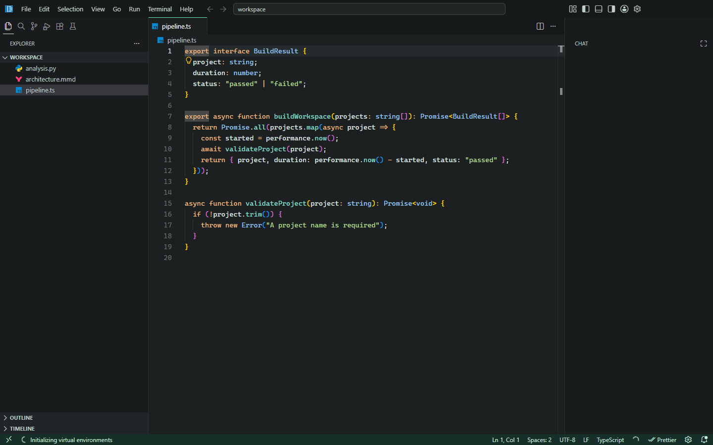

# FreedomEditor

[Windows Installation Guide](freedomeditor/DEVELOPMENT.md) | [Current Status](#install-on-windows)

**Your editor. Your workflow. Windows first.**

FreedomEditor is Hrithik Raj's community fork of Microsoft's MIT-licensed
**Code - OSS**, with an Antigravity-inspired workspace layout, original branding,
and customizable coding defaults. The VS Code editor, terminal, debugger, Git
integration, and extension API remain underneath.

It is not an official Microsoft or Google product. No Antigravity code, assets,
models, or services are included. Visual inspiration does not imply affiliation.

## Install on Windows

**Current status: source preview only. No Windows installer is published yet.**
There is no `FreedomEditorSetup.exe` to download from this repository or its
Releases page. Packaging stopped because the build machine is missing the
Windows SDK's SignTool. Full GUI validation is also unfinished.

The [Windows Installation Guide](freedomeditor/DEVELOPMENT.md) explains the
current source-build option and the missing prerequisites. Installing Microsoft
Build Tools installs **build prerequisites only**, not FreedomEditor or VS Code.

The intended one-click installer targets **Windows 10 (2004+) and Windows 11,
x64** and will be listed under
[Releases](https://github.com/HrithikRaj1999/FreedomEditor/releases) after packaging
and validation succeed. It will bundle Electron; end users will not need the
build tools or a separate Electron installation. Python execution will still
need a Python runtime, and TypeScript projects need their normal dependencies.

GitHub's source ZIP is not an installer. Code signing is not configured yet.

## What You Get

- Familiar VS Code editing, navigation, debugging, Git, terminals, and extension APIs.
- A top activity bar, command center, and secondary sidebar inspired by agent-oriented editors.
- **Freedom Graphite** and **Freedom Paper** themes with readable syntax colors and original icons.
- Native customization: search the Command Palette for **FreedomEditor: Customize Editor**.
- Python, Debugpy, BasedPyright, Ruff, ESLint, Prettier, Mermaid previews, PDF viewing, and Material Icon Theme through Open VSX.
- Built-in JavaScript/TypeScript language services; no extra TypeScript editor extension is required.
- Separate settings and extension storage. Regular VS Code remains your fallback.
- Source-build tools for one-way settings sync, backups, stable update checks, staging, and rollback.

Extensions are downloaded when selected during installation; internet access is
required. They are not all bundled or covered by this repository's MIT license.
The gallery is [Open VSX](https://open-vsx.org/). Marketplace-only extensions,
proposed APIs, product checks, and proprietary services may not work in a fork.
Install only extensions you trust and whose licenses permit your use.

## Why the Approval Changes?

This started with a local workflow problem: selecting an "Allow All" option did
not consistently avoid further approval prompts across chat tools, terminal
execution, and agent-host policy paths. Those are separate decision points, not
one universal switch. This fork changes several local approval checks together.

**Important: this experimental fork currently treats every chat permission level
as auto-approved, including the UI's manual/default level.** Terminal approval
checks are also more permissive. A displayed permission label must not be taken
as a safety boundary. Agents can run destructive commands or expose accessible
data without another prompt. Use a disposable environment with no sensitive
credentials, and inspect the code changes before enabling an agent. Use official
VS Code when you need its normal approval protections.

This is not a claim of "no restrictions whatsoever." Windows permissions,
security software, organizational controls, network policies, extension licenses,
and provider-side rules still apply. Paid AI services are not made free, and
service-side safeguards are not removed. Copilot availability and sign-in are
subject to GitHub's terms and compatibility.

## Updates and Performance

The current source base is **VS Code 1.137.0**. FreedomEditor is a separate build;
official VS Code's binary updater cannot safely update it. Source users can run
`scripts/freedomeditor.ps1 -Action check` or `-Action update`. The updater checks
Microsoft's stable release against its Git tag, stages local changes separately,
and only queues a release after building and testing it. Conflicts or missing
build prerequisites leave the active editor unchanged. There can be update lag.

Future installer releases will be distributed through this repository's Releases page.
Automatic signed binary updates are not implemented. The native layout avoids
an extra webview UI, but no benchmark demonstrates that this fork is faster or
uses less memory than official VS Code or Antigravity.

## Build and Customize

See [the Windows build guide](freedomeditor/DEVELOPMENT.md) for prerequisites,
source launch, settings overrides, update automation, and installer creation.

The complete publishable project is this repository. Main customization paths:

- `extensions/freedomeditor/`: themes, coding defaults, and native customization commands.
- `freedomeditor/`: original branding, extension selection, and Windows installer definition.
- `scripts/freedomeditor*`: launcher, update/profile tools, tests, and build automation.
- `product.json`: product identity and extension gallery.

Personal profiles, credentials, update state, and downloaded runtimes belong in
the ignored `.freedomeditor/` folder, **never in Git**. Existing installations can
keep their profile folders elsewhere; do not upload those folders.

## Community and License

Report reproducible issues and suggest improvements at
[HrithikRaj1999/FreedomEditor](https://github.com/HrithikRaj1999/FreedomEditor/issues).
Pull requests for compatibility, accessible UI, explicit permission controls,
Windows packaging, and verified performance improvements are welcome.

Code - OSS source retains Microsoft's copyright and [MIT license](LICENSE.txt).
FreedomEditor additions are MIT-licensed. Retain upstream notices and
[third-party notices](ThirdPartyNotices.txt). Bundled third-party software and
extensions have their own licenses. VS Code, GitHub Copilot, and Antigravity
names belong to their respective owners.

Upstream Code - OSS README and attribution

## Visual Studio Code - Open Source ("Code - OSS")

## The Repository

This repository ("`Code - OSS`") is where we (Microsoft) develop the [Visual Studio Code](https://code.visualstudio.com) product together with the community. Not only do we work on code and issues here, but we also publish our [roadmap](https://github.com/microsoft/vscode/wiki/Roadmap), [monthly iteration plans](https://github.com/microsoft/vscode/wiki/Iteration-Plans), and our [endgame plans](https://github.com/microsoft/vscode/wiki/Running-the-Endgame). This source code is available to everyone under the standard [MIT license](https://github.com/microsoft/vscode/blob/main/LICENSE.txt).

## Visual Studio Code

  

[Visual Studio Code](https://code.visualstudio.com) is a distribution of the `Code - OSS` repository with Microsoft-specific customizations released under a traditional [Microsoft product license](https://code.visualstudio.com/License/).

[Visual Studio Code](https://code.visualstudio.com) combines the simplicity of a code editor with what developers need for their core edit-build-debug cycle. It provides comprehensive code editing, navigation, and understanding support along with lightweight debugging, a rich extensibility model, and lightweight integration with existing tools.

Visual Studio Code is updated monthly with new features and bug fixes. You can download it for Windows, macOS, and Linux on the [Visual Studio Code website](https://code.visualstudio.com/Download). To get the latest releases every day, install the [Insiders build](https://code.visualstudio.com/insiders).

## Contributing

There are many ways in which you can participate in this project, for example:

* [Submit bugs and feature requests](https://github.com/microsoft/vscode/issues), and help us verify them as they are checked in
* Review [source code changes](https://github.com/microsoft/vscode/pulls)
* Review the [documentation](https://github.com/microsoft/vscode-docs) and make pull requests for anything from typos to new content.

If you are interested in fixing issues and contributing directly to the codebase, please see the document [How to Contribute](https://github.com/microsoft/vscode/wiki/How-to-Contribute), which covers the following:

* [How to build and run from source](https://github.com/microsoft/vscode/wiki/How-to-Contribute)
* [The development workflow, including debugging and running tests](https://github.com/microsoft/vscode/wiki/How-to-Contribute#debugging)
* [Coding guidelines](https://github.com/microsoft/vscode/wiki/Coding-Guidelines)
* [Submitting pull requests](https://github.com/microsoft/vscode/wiki/How-to-Contribute#pull-requests)
* [Finding an issue to work on](https://github.com/microsoft/vscode/wiki/How-to-Contribute#where-to-contribute)
* [Contributing to translations](https://aka.ms/vscodeloc)

## Feedback

* Ask a question on [Stack Overflow](https://stackoverflow.com/questions/tagged/vscode)
* [Request a new feature](CONTRIBUTING.md)
* Upvote [popular feature requests](https://github.com/microsoft/vscode/issues?q=is%3Aopen+is%3Aissue+label%3Afeature-request+sort%3Areactions-%2B1-desc)
* [File an issue](https://github.com/microsoft/vscode/issues)
* Connect with the extension author community on [GitHub Discussions](https://github.com/microsoft/vscode-discussions/discussions) or [Slack](https://aka.ms/vscode-dev-community)
* Follow [@code](https://x.com/code) and let us know what you think!

See our [wiki](https://github.com/microsoft/vscode/wiki/Feedback-Channels) for a description of each of these channels and information on some other available community-driven channels.

## Related Projects

Many of the core components and extensions to VS Code live in their own repositories on GitHub. For example, the [node debug adapter](https://github.com/microsoft/vscode-node-debug) and the [mono debug adapter](https://github.com/microsoft/vscode-mono-debug) repositories are separate from each other. For a complete list, please visit the [Related Projects](https://github.com/microsoft/vscode/wiki/Related-Projects) page on our [wiki](https://github.com/microsoft/vscode/wiki).

## Bundled Extensions

VS Code includes a set of built-in extensions located in the [extensions](extensions) folder, including grammars and snippets for many languages. Extensions that provide rich language support (inline suggestions, Go to Definition) for a language have the suffix `language-features`. For example, the `json` extension provides coloring for `JSON` and the `json-language-features` extension provides rich language support for `JSON`.

## Development Container

This repository includes a Visual Studio Code Dev Containers / GitHub Codespaces development container.

* For [Dev Containers](https://aka.ms/vscode-remote/download/containers), use the **Dev Containers: Clone Repository in Container Volume...** command, which creates a Docker volume for better disk I/O on macOS and Windows.
  * If you already have VS Code and Docker installed, you can also click [here](https://vscode.dev/redirect?url=vscode://ms-vscode-remote.remote-containers/cloneInVolume?url=https://github.com/microsoft/vscode) to get started. This will cause VS Code to automatically install the Dev Containers extension if needed, clone the source code into a container volume, and spin up a dev container for use.

* For Codespaces, install the [GitHub Codespaces](https://marketplace.visualstudio.com/items?itemName=GitHub.codespaces) extension in VS Code, and use the **Codespaces: Create New Codespace** command.

Docker / the Codespace should have at least **4 cores and 6 GB of RAM (8 GB recommended)** to run a full build. See the [development container README](.devcontainer/README.md) for more information.

## Code of Conduct

This project has adopted the [Microsoft Open Source Code of Conduct](https://opensource.microsoft.com/codeofconduct/). For more information, see the [Code of Conduct FAQ](https://opensource.microsoft.com/codeofconduct/faq/) or contact [opencode@microsoft.com](mailto:opencode@microsoft.com) with any additional questions or comments.

## License

Copyright (c) Microsoft Corporation. All rights reserved.

Licensed under the [MIT](LICENSE.txt) license.

